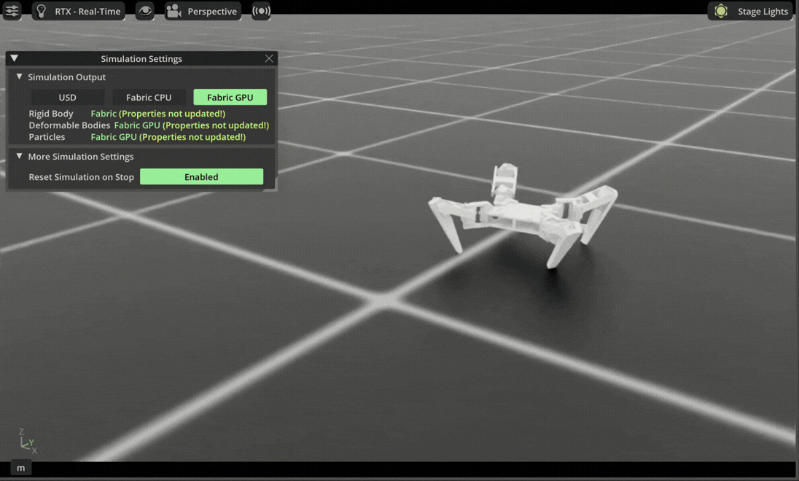

# Spider Bot Training

Quadruped spider robot locomotion using PPO on [NVIDIA Isaac Lab](https://isaac-sim.github.io/IsaacLab).

A 12-DOF MG995-based spider robot trained with reinforcement learning for velocity-tracking locomotion and trot gait coordination.



## Features

- **12-DOF spider robot** — 4 legs × 3 joints (hip, thigh, calf), modeled in URDF/USD
- **200 parallel environments** for efficient training
- **PPO via RSL-RL and skrl** with tuned hyperparameters
- **AMP support** via skrl
- **11 reward terms** — velocity tracking, trot gait, smoothness, joint regularization
- **Trot gait** — diagonal foot pairs (FL+RR, FR+RL)
- **Keyboard teleoperation** — WASD + QE velocity control
- **Checkpoint export** — JIT and ONNX

## Motor Configuration

The robot uses MG995 servos configured as implicit actuators in Isaac Lab:

| Parameter | Value | Description |
|-----------|-------|-------------|
| effort_limit | 1.0 | Maximum torque (N·m) |
| velocity_limit | 6.5 | Maximum velocity (rad/s) |
| stiffness | 25.0 | Proportional gain for position control |
| damping | 1 | Derivative gain for velocity damping |

## Repository Structure

```
Big_bertha/
├── assets/
│   ├── GIF/              # demo recordings
│   ├── URDF/             # URDF description, meshes, USD configs
│   └── usd/              # USD robot description files
├── scripts/
│   ├── rsl_rl/           # train.py, play.py, play_fixed_velocity.py, cli_args.py
│   ├── skrl/             # train.py, play.py
│   ├── random_agent.py
│   ├── zero_agent.py
│   └── list_envs.py
└── source/
    └── Big_bertha/       # IsaacLab extension
        ├── config/extension.toml
        ├── setup.py
        └── Big_bertha/
            ├── assets/Big_bertha.py        # robot articulation config
            ├── tasks/direct/big_bertha/    # RL env + agent configs
            │   ├── big_bertha_env.py
            │   ├── big_bertha_env_cfg.py
            │   └── agents/
            │       ├── rsl_rl_ppo_cfg.py
            │       ├── skrl_ppo_cfg.yaml
            │       └── skrl_amp_cfg.yaml
            └── ui_extension_example.py
```

## Setup

```bash
# Install the extension
python -m pip install -e source/Big_bertha
```

## Training

```bash
# RSL-RL
python scripts/rsl_rl/train.py --task Big_Bertha --num_envs 200 --headless

# skrl
python scripts/skrl/train.py --task Big_Bertha --num_envs 200 --headless

# Or use the interactive launcher
bash scripts/train.sh
```

### Resume Training

```bash
python scripts/rsl_rl/train.py --task Big_Bertha --resume \
    --load_run <run_dir> --checkpoint model_xxxx.pt
```

## Inference

```bash
python scripts/rsl_rl/play.py --task Big_Bertha --checkpoint <path/to/model.pt>

# Fixed velocity (X Y YAW)
python scripts/rsl_rl/play.py --task Big_Bertha --checkpoint <path> --fixed_velocity 0.5 0.0 0.0

# Or use the interactive launcher
bash scripts/play.sh
```

## Teleoperation

```bash
python scripts/rsl_rl/play_teleop.py --task Big_Bertha
```

| Key | Action |
|-----|--------|
| W/S | Forward/Backward |
| A/D | Strafe Left/Right |
| Q/E | Turn Left/Right |
| SPACE | Stop |

## Reward Terms

| Term | Scale | Purpose |
|------|-------|---------|
| lin_vel | 5.0 | Track target velocity |
| yaw_rate | 1.0 | Track target turning |
| z_vel | -2.0 | Prevent bouncing |
| ang_vel | -0.02 | Penalize tilt |
| joint_torque | -1e-5 | Energy efficiency |
| joint_accel | -1e-7 | Smooth acceleration |
| action_rate | -0.01 | Smooth actions |
| flat_orientation | -1.5 | Keep upright |
| joint_activity | 0.1 | Encourage joint use |
| feet_air_time | 0.01 | Foot lift |
| alternating_gait | 0.2 | Trot coordination |

## Development

```bash
pip install pre-commit
pre-commit install
pre-commit run --all-files
```
