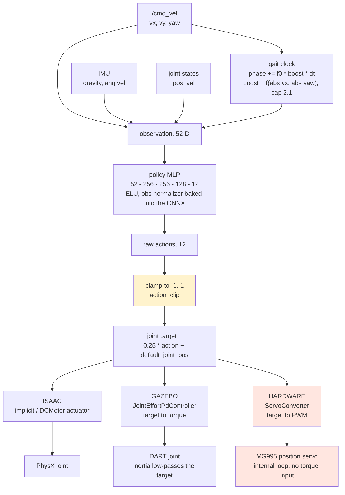

# Big Bertha deployment pipeline

How a velocity command becomes joint motion, and what differs between Isaac,
Gazebo and hardware. The three paths share an observation contract and a policy;
they diverge entirely in what consumes the policy's output, and that divergence
is the whole sim-to-real story.

## Observation contract (52-D)

Built identically in training (`big_bertha_env.py`) and deployment
(`observation_builder.hpp`). Any change here is a major version bump.

| dims | contents | notes |
| --- | --- | --- |
| 0-2 | `root_lin_vel_b` | body-frame linear velocity |
| 3-5 | `root_ang_vel_b` | body-frame angular velocity |
| 6-8 | `projected_gravity_b` | gravity in body frame; the tilt signal |
| 9-11 | `commands` | vx, vy, yaw rate |
| 12-23 | `joint_pos - default_joint_pos` | type-grouped: 4 hips, 4 knees, 4 ankles |
| 24-35 | `joint_vel` | same order |
| 36-47 | `prev_actions` | post-clamp |
| 48-51 | gait clock | `sin(2*pi*(phase + offset_i))`, offsets `[0, 0.5, 0.25, 0.75]` |

The gait clock is an **external** signal, not learned. Its cadence scales with
commanded speed and yaw magnitude, capped at 2.1x. It is the reason the policy
walks in phase rather than inventing its own rhythm, and getting its sign
handling wrong is what silently broke reverse in the first v2.0.0 attempt.

## Flow

## Where the three paths diverge

Isaac and Gazebo both put a **force-producing element** between the target and
the joint. Gazebo's `JointEffortPdController` turns the position target into a
bounded torque and link inertia integrates it; Isaac's actuator model does the
same job. Either way the target is a *setpoint* and the physics smooths it.

Hardware has no such stage. `use_effort: false` is correct there, because an
MG995 is a position servo with its own internal loop and no torque interface.
But the consequence is that whatever waveform the policy emits arrives at the
joint intact.

That is why a saturated policy walks convincingly in both simulators and badly
on hardware. v1.1.0 emitted `abs(a) ~ 1e4` and was 100% clamped, so every joint
target was a two-level square wave; it walked in sim because the actuators
low-passed it, and on hardware it slammed. The `action_l2` penalty added in
v2.0.0 reduced that by three orders of magnitude, but the exported policy still
sits on the clamp 89% of the time (see the known limitations in the README), so
the bringup applies an EWMA (`smoothing_alpha`) to shape the waveform before it
reaches the servos.

## Joint ordering

The policy uses **type-grouped** order throughout: indices 0-3 hips, 4-7 knees,
8-11 ankles, with each group ordered `[Revolute_110, 113, 116, 119]`.

Derived from the URDF, those are:

| index | joint | position |
| --- | --- | --- |
| 0 | Revolute_110 | front-left |
| 1 | Revolute_113 | back-left |
| 2 | Revolute_116 | back-right |
| 3 | Revolute_119 | front-right |

The contact sensor uses a **different** order. `find_bodies([arm_c_1_1 ...
arm_c_4_1])` resolves through `Revolute_113/116/119/110`, giving
`[BL, BR, FR, FL]`.

These two orders are easy to confuse and have been confused repeatedly: at
various points `symmetry.py`, `legged_odometry.yaml` and `big_bertha_env.py`
each carried leg labels that disagreed with the URDF and with each other. Take
ordering from the URDF, never from a comment.
